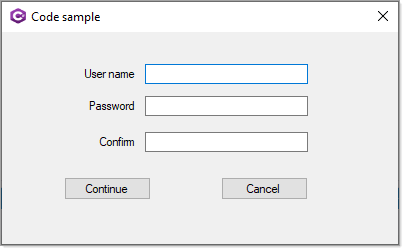

Simple example for a login using custom validation rules.



**Table structure**

```sql
USE [UserLoginExample]
GO
/****** Object:  Table [dbo].[Users]    Script Date: 3/7/2022 7:50:38 AM ******/
SET ANSI_NULLS ON
GO
SET QUOTED_IDENTIFIER ON
GO
CREATE TABLE [dbo].[Users](
	[Id] [int] IDENTITY(1,1) NOT NULL,
	[UserName] [nvarchar](max) NULL,
	[RoleType] [int] NULL,
 CONSTRAINT [PK_Users] PRIMARY KEY CLUSTERED 
(
	[Id] ASC
)WITH (PAD_INDEX = OFF, STATISTICS_NORECOMPUTE = OFF, IGNORE_DUP_KEY = OFF, ALLOW_ROW_LOCKS = ON, ALLOW_PAGE_LOCKS = ON) ON [PRIMARY]
) ON [PRIMARY] TEXTIMAGE_ON [PRIMARY]
GO

```