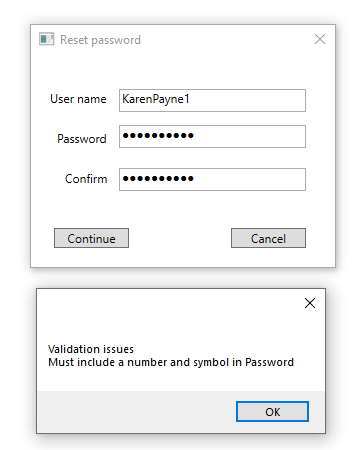

# Working with DataAnnotations

Simple WPF login demonstration using data annotations using a custom validation rule.



Usually, to protect someone for guessing a user's password a common practice is to require upper-case characters, include at least one numeric and one special character. The following class provides a place to set rules as per uppercased, numeric and special chars.

```csharp
public class PasswordCheck : ValidationAttribute
{
    public override bool IsValid(object value)
    {
        var validPassword = false;
        var reason = string.Empty;
        var password = (value == null) ? string.Empty : value.ToString();

        if (string.IsNullOrWhiteSpace(password) || password.Length < 6)
        {
            reason = "new password must be at least 6 characters long. ";
        }
        else
        {
            var pattern = new Regex("((?=.*\\d)(?=.*[a-z])(?=.*[A-Z])(?=.*[@#$%]).{6,20})");
            if (!pattern.IsMatch(password))
            {
                reason += "Your new password must contain at least 1 symbol character and number.";
            }
            else
            {
                validPassword = true;
            }
        }

        if (validPassword)
        {
            return true;
        }
        else
        {
            return false;
        }

    }

}
```
Another example would be validation on a credit card using the following [code sample](https://benjii.me/2010/11/credit-card-validator-attribute-for-asp-net-mvc-3/).