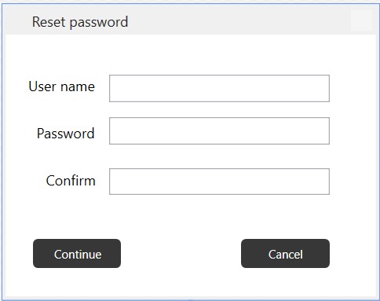
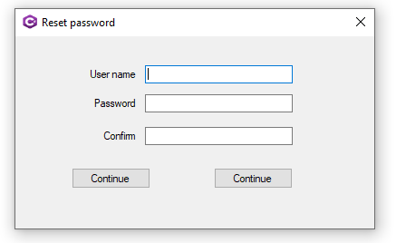
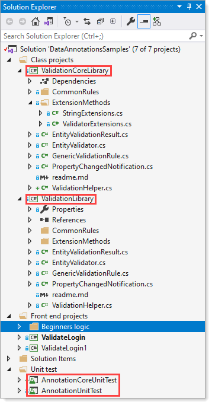
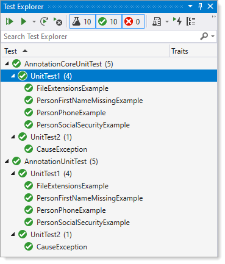

# Working with Data Annotations


## Overview

Present bare bones code samples for validating data using data annotations.

The .NET Framework uses many different approaches for validation. In this repository, there is a simple example for WPF using a local class project for validating properties in a class, which test for string length and rules for setting a password. It is intentional to keep MVVM out of the code samples so that new developers can have an easy working solution.

Simple WPF login demonstration using data annotations using a custom validation rule.

For an application in the wild one might think that showing validation issues is bad, not in the case were this is an internal process and one must also enter their current password or a temp password provided by an admin or reset password service.

The [following page](https://github.com/karenpayneoregon/wpf-login-annotations-cs/blob/master/Article/article.md) does a walkthrough for implementing a password reset along with several simple examples for string validation and social security validation going past *conventional* is it nine characters that are numbers.

### Implementing

A common usage is to ensure a string value going to a database table does not exceed max length of the column in a table and/or the string value must be at least X characters in length.

Here the property UserName must not be longer than ten characters with a minimum length of six because of [[StringLength]](https://referencesource.microsoft.com/#System.ComponentModel.DataAnnotations/DataAnnotations/StringLengthAttribute.cs) annotation.

```csharp
[StringLength(10, MinimumLength = 6)]
public string UserName { get; set; }
```

If UserName is required by the table by adding the [[Required]](https://referencesource.microsoft.com/#System.ComponentModel.DataAnnotations/DataAnnotations/RequiredAttribute.cs) attribute and no value is given on validating this causes marks the object as invalid.

```csharp
[Required(ErrorMessage = "{0} is required"), DataType(DataType.Text)]
[StringLength(10, MinimumLength = 6)]
public string UserName { get; set; }
```

Usage in a unit test

```csharp
[TestMethod]
public void PersonFirstNameMissingExample()
{
    Person person = new Person()
    {
        FirstName = "Jimmy Bob",
        LastName = "Jones",
        Phone = "(305) 444-9999",
        SSN = "201518161"
    };

    EntityValidationResult validationResult = 
        ValidationHelper.ValidateEntity(person);

    Assert.IsFalse(validationResult.HasError);

    person.FirstName = "";
    validationResult = ValidationHelper.ValidateEntity(person);

    Assert.IsTrue(validationResult.Errors.Count == 1 && 
                  validationResult.ErrorMessageList().Contains("First Name"));

}
```


#### Validation code
Actual validation is done from code in the [Validation library](https://github.com/karenpayneoregon/wpf-login-annotations-cs/tree/master/ValidationLibrary), which is a class project that can be used in any of WPF or Windows Form projects by adding the DLL to a project.

To validate an object first populate the object then run the method ValidateEntity of the class [EntityValidationResult](https://github.com/karenpayneoregon/wpf-login-annotations-cs/blob/master/ValidationLibrary/EntityValidationResult.cs) followed by checking [HasError property](https://github.com/karenpayneoregon/wpf-login-annotations-cs/blob/master/ValidationLibrary/EntityValidationResult.cs#L12) and if there are errors they are listed in [Errors property](https://github.com/karenpayneoregon/wpf-login-annotations-cs/blob/master/ValidationLibrary/EntityValidationResult.cs#L13). To expose all errors use the extension method [ErrorMessageList](https://github.com/karenpayneoregon/wpf-login-annotations-cs/blob/master/ValidationLibrary/ExtensionMethods/ValidatorExtensions.cs).

#### Practical example

We have someone who needs to reset their password which usually requires a user name, current password followed by a new password and also a confirmation on the new password. In the following example it is missing the current password along with only code to validate user name and new password plus making sure both new password entries match.

The following is the window to collect information for a password reset.




XAML
```xaml
<Window x:Class="ValidateLogin.MainWindow"
    xmlns="http://schemas.microsoft.com/winfx/2006/xaml/presentation"
    xmlns:x="http://schemas.microsoft.com/winfx/2006/xaml"
    xmlns:d="http://schemas.microsoft.com/expression/blend/2008"
    xmlns:local="clr-namespace:ValidateLogin"
    xmlns:mc="http://schemas.openxmlformats.org/markup-compatibility/2006"
    Title="Reset password"
    Width="320.12"
    Height="251.129"
    Closing="MainWindow_OnClosing"
    KeyDown="Window_KeyDown"
    ResizeMode="NoResize"
    WindowStartupLocation="CenterScreen"
    Icon="sharp.ico"
    mc:Ignorable="d">


    <Window.CommandBindings>

        <CommandBinding
            CanExecute="PasswordCheckCanExecuteCommand"
            Command="{x:Static local:MainWindow.ContinueRoutedCommand}"
            Executed="PasswordCheckCommandOnExecute" />

        <CommandBinding
            CanExecute="ApplicationExitCanExecute"
            Command="{x:Static local:MainWindow.ExitRoutedCommand}"
            Executed="ExitApplicationCommandOnExecute" />

    </Window.CommandBindings>

    <Grid FocusManager.FocusedElement="{Binding ElementName=UserNameTextBox}">
        <Label
            Margin="14,30,0,0"
            HorizontalAlignment="Left"
            VerticalAlignment="Top"
            Content="User name"
            RenderTransformOrigin="0.45,0.261" />
        <TextBox
            Width="187"
            Height="23"
            Margin="88,34,0,0"
            HorizontalAlignment="Left"
            VerticalAlignment="Top"
            Text="{Binding UserName, UpdateSourceTrigger=PropertyChanged}"
            TextWrapping="Wrap" />
        <Label
            Margin="21,70,0,0"
            HorizontalAlignment="Left"
            VerticalAlignment="Top"
            Content="Password" />
        <Label
            Margin="29,110,0,0"
            HorizontalAlignment="Left"
            VerticalAlignment="Top"
            Content="Confirm" />
        <PasswordBox
            Width="187"
            Height="23"
            Margin="88,70,0,0"
            HorizontalAlignment="Left"
            VerticalAlignment="Top"
            PasswordChanged="PasswordTextBox_OnPasswordChanged" />
        <PasswordBox
            Width="187"
            Height="23"
            Margin="88,113,0,0"
            HorizontalAlignment="Left"
            VerticalAlignment="Top"
            PasswordChanged="PasswordConfirmTextBox_OnPasswordChanged" />
        <Button
            Width="75"
            Margin="23,173,0,0"
            HorizontalAlignment="Left"
            VerticalAlignment="Top"
            Command="{x:Static local:MainWindow.ContinueRoutedCommand}"
            Content="Continue" />
        <Button
            Width="75"
            Margin="200,173,0,0"
            HorizontalAlignment="Left"
            VerticalAlignment="Top"
            Command="{x:Static local:MainWindow.ExitRoutedCommand}"
            Content="Cancel" />

    </Grid>
</Window>
```

Code behind

- The variable _retryCount keeps track of failed attempts to reset a password which in this case missing information or passwords do not match. The password check is two-fold, a custom attribute, [PasswordCheck](https://github.com/karenpayneoregon/wpf-login-annotations-cs/blob/master/ValidateLogin/Classes/ValidationRules/PasswordCheck.cs) for ensuring the password has at least one symbol and one number. The second part is the [Compare](https://referencesource.microsoft.com/#System.ComponentModel.DataAnnotations/DataAnnotations/CompareAttribute.cs) attribute.
- The method process ProcessLogin passes the private variable _customerLogin of type [CustomerLogin](https://github.com/karenpayneoregon/wpf-login-annotations-cs/blob/master/ValidateLogin/Classes/CustomerLogin.cs) to the validator which in turn a check is made to see if there are validation errors, if so increment the retry count if under the limit or terminate. Otherwise if validation is successful open another window which would represent a main screen in an application or some may simply want to termiante as in real life this may very well be a stand along process.


```csharp
namespace ValidateLogin
{

    public partial class MainWindow : Window
    {
        private int _retryCount = 0;

        public static RoutedCommand ContinueRoutedCommand = new RoutedCommand();
        public static RoutedCommand ExitRoutedCommand = new RoutedCommand();

        private readonly CustomerLogin _customerLogin = new CustomerLogin();

        public MainWindow()
        {

            InitializeComponent();

            CommandBindings.Add(new CommandBinding(
                ContinueRoutedCommand, 
                PasswordCheckCommandOnExecute, 
                PasswordCheckCanExecuteCommand));

            CommandBindings.Add(new CommandBinding(
                ExitRoutedCommand, 
                ExitApplicationCommandOnExecute, 
                ApplicationExitCanExecute));

            DataContext = _customerLogin;

        }
        /// <summary>
        /// Validate user name and password logic for up to three failed attempts
        /// </summary>
        /// <param name="sender"></param>
        /// <param name="e"></param>
        private void PasswordCheckCommandOnExecute(object sender, ExecutedRoutedEventArgs e)
        {
            ProcessLogin();
        }
        /// <summary>
        /// Determine if rules for a resetting a password are met using property data
        /// annotation in the class CustomerLogin. Rules for a password are done
        /// in <see cref="PasswordCheck"/> class.
        /// </summary>
        private void ProcessLogin()
        {
            EntityValidationResult validationResult = ValidationHelper.ValidateEntity(_customerLogin);

            if (validationResult.HasError)
            {
                _retryCount += 1;

                if (_retryCount >= 3)
                {
                    MessageBox.Show("Too many attempts");
                    Application.Current.Shutdown();
                }
                else
                {
                    MessageBox.Show(validationResult.ErrorMessageList());
                }
            }
            else
            {
                Hide();

                var workWindow = new WorkWindow();
                Application.Current.MainWindow = workWindow;
                workWindow.ShowDialog();

                Close();
            }
        }

        private void PasswordCheckCanExecuteCommand(object sender, CanExecuteRoutedEventArgs e) => 
            e.CanExecute = _retryCount < 3;

        private void ExitApplicationCommandOnExecute(object sender, ExecutedRoutedEventArgs e)
        {
            if (Question("Cancel login?"))
            {
                Application.Current.Shutdown();
            }
        }

        private void ApplicationExitCanExecute(object sender, CanExecuteRoutedEventArgs e) => 
            e.CanExecute = true;

        private void MainWindow_OnClosing(object sender, CancelEventArgs e)
        {

            if (Environment.UserName == "PayneK")
            {
                Application.Current.Shutdown();
            }
            else
            {
                if (Question("Cancel login?"))
                {
                    Application.Current.Shutdown();
                }
                else
                {
                    e.Cancel = true;
                }

            }
        }
        /// <summary>
        /// Set confirm password to the logon object
        /// </summary>
        /// <param name="sender"></param>
        /// <param name="e"></param>
        private void PasswordConfirmTextBox_OnPasswordChanged(object sender, RoutedEventArgs e) => 
            _customerLogin.PasswordConfirmation = ((PasswordBox) sender).Password;

        /// <summary>
        /// Set password to the logon object
        /// </summary>
        /// <param name="sender"></param>
        /// <param name="e"></param>
        private void PasswordTextBox_OnPasswordChanged(object sender, RoutedEventArgs e)
        {
            _customerLogin.Password = ((PasswordBox)sender).Password;
        }

        private void Window_KeyDown(object sender, KeyEventArgs e)
        {
            if (e.Key == Key.Return)
            {
                ProcessLogin();
            }
        }
    }

}

```

Working with Windows forms follows the same exact logic other than how data is collected.

```csharp
namespace ValidateLogin1
{
    public partial class Form1 : Form
    {
        private int _retryCount = 0;
        private readonly BindingSource _bindingSource = new BindingSource();

        public Form1()
        {
            InitializeComponent();

            _bindingSource.DataSource = new List<CustomerLogin>() {new CustomerLogin()};

            UserNameTextBox.DataBindings.Add("Text", _bindingSource, "UserName", 
                false, DataSourceUpdateMode.OnPropertyChanged);

            PasswordTextBox.DataBindings.Add("Text", _bindingSource, "Password", 
                false, DataSourceUpdateMode.OnPropertyChanged);

            ConfirmPasswordTextBox.DataBindings.Add("Text", _bindingSource, "PasswordConfirmation",
                false, DataSourceUpdateMode.OnPropertyChanged);
            
        }

        private void ProcessLogin()
        {
            var customerLogin = (CustomerLogin) _bindingSource.Current;

            EntityValidationResult validationResult = ValidationHelper.ValidateEntity(customerLogin);

            if (validationResult.HasError)
            {
                _retryCount += 1;

                if (_retryCount >= 3)
                {
                    MessageBox.Show("Too many attempts");
                    Application.Exit();
                }
                else
                {
                    MessageBox.Show(validationResult.ErrorMessageList());
                }
            }
            else
            {
                Hide();

                var workForm = new WorkForm();
                workForm.ShowDialog();

                Close();
            }

        }

        private void ContinueButton_Click(object sender, EventArgs e)
        {
            ProcessLogin();
        }
        protected override bool ProcessCmdKey(ref Message msg, Keys keyData)
        {
            if (keyData != (Keys.Enter)) return base.ProcessCmdKey(ref msg, keyData);
            ProcessLogin();

            return true;

        }

        private void CancelButton_Click(object sender, EventArgs e)
        {
            Close();
        }
    }
}

```


## Projects
The project [ValidateLogin](https://github.com/karenpayneoregon/wpf-login-annotations-cs/tree/master/ValidateLogin) is a WPF C# (not MVVM) project using data annotations on properties in a class representing a login. Beings this is a simply example there is no reading or updating tables in a database or a validation for if a current password is valid. Each property has rules ranging from string length to rules, which make up a decent password along with validating when the user types in the password they need to also confirm the new password done using a data annotation.

The project [ValidateLogin1](https://github.com/karenpayneoregon/wpf-login-annotations-cs/tree/master/ValidateLogin1) is a Windows form project which uses the exact same validation done in ValidateLogin which differs from the WPF only by using form logic verses how things are done in WPF.

The project [WindowsFormApp1](https://github.com/karenpayneoregon/wpf-login-annotations-cs/tree/master/WindowsFormsApp1) is how a developer might perform validation not using data annotations.

The project [ValidationLibrary](https://github.com/karenpayneoregon/wpf-login-annotations-cs/tree/master/ValidationLibrary) contains base code logic for performing valiation on properties of a class.

The project [AnnotationUnitTest](https://github.com/karenpayneoregon/wpf-login-annotations-cs/tree/master/AnnotationUnitTest) demonstrate several common annotations and a custom annotation of social security number going past the normal nine digit test.
# See also

Microsoft [documentation](https://docs.microsoft.com/en-us/dotnet/api/system.componentmodel.dataannotations?view=netcore-3.1) on standard annotation classes. Note that in some cases the standard attributes will not always fit your needs such as email addresses which leads into creating your own like for [social security number](https://github.com/karenpayneoregon/wpf-login-annotations-cs/blob/master/ValidationLibrary/CommonRules/SocialSecurityAttribute.cs). Also, see [source code](https://referencesource.microsoft.com/#System.ComponentModel.DataAnnotations/DataAnnotations/CreditCardAttribute.cs).

For VB.NET developers see the following [GitHub repository](https://github.com/karenpayneoregon/ClassValidationVisualBasic1).


### Requires

For work window image animation [WPF Animated GIF](http://example.com). Perform a NuGet restore packages before building the solution.


Usually, to protect someone for guessing a user's password a common practice is to require upper-case characters, include at least one numeric and one special character. The following class provides a place to set rules as per uppercased, numeric and special chars.

```csharp
public class PasswordCheck : ValidationAttribute
{
    public override bool IsValid(object value)
    {
        var validPassword = false;
        var reason = string.Empty;
        var password = (value == null) ? string.Empty : value.ToString();

        if (string.IsNullOrWhiteSpace(password) || password.Length < 6)
        {
            reason = "new password must be at least 6 characters long. ";
        }
        else
        {
            var pattern = new Regex("((?=.*\\d)(?=.*[a-z])(?=.*[A-Z])(?=.*[@#$%]).{6,20})");
            if (!pattern.IsMatch(password))
            {
                reason += "Your new password must contain at least 1 symbol character and number.";
            }
            else
            {
                validPassword = true;
            }
        }

        if (validPassword)
        {
            return true;
        }
        else
        {
            return false;
        }

    }

}
```
Another example would be validation on a credit card using the following [code sample](https://benjii.me/2010/11/credit-card-validator-attribute-for-asp-net-mvc-3/).

[Model validation in ASP.NET Core MVC and Razor Pages](https://docs.microsoft.com/en-us/aspnet/core/mvc/models/validation?view=aspnetcore-5.0)


### Windows Form example



---
Original code done with Framework 4.7.2 and instead of attempting to convert the existing code to .NET Core a new class project was created, code from current .NET Framework 4 was pasted into the new project. Next a separate unit test project was created to test the new .NET Core project.

Using the above if something went wrong the original code remains in tact. Way too many developers will

:x: Not use source control hence bad code cannot be reverted

:heavy_check_mark: Always use source control to revert changes

Using source control in this case on both projects keeps working code safe.

:x: Do not wait hours to commit

:heavy_check_mark: Commit often with good comments on each commit.




Always test!!!

