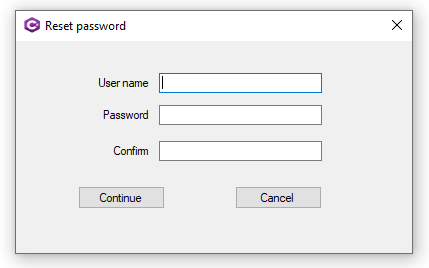

# Working with Data Annotations

Simple WPF login demonstration using data annotations using a custom validation rule.

For an application in the wild one might think that showing validation issues is bad, not in the case were this is an internal process and one must also enter their current password or a temp password provided by an admin or reset password service.

The [following page](https://github.com/karenpayneoregon/wpf-login-annotations-cs/blob/master/Article/article.md) does a walkthrough for implementing a password reset along with several simple examples for string validation and social security validation going past *conventional* is it nine characters that are numbers.

### Requires

For work window image animation [WPF Animated GIF](http://example.com). Perform a NuGet restore packages before building the solution.


Usually, to protect someone for guessing a user's password a common practice is to require upper-case characters, include at least one numeric and one special character. The following class provides a place to set rules as per uppercased, numeric and special chars.

```csharp
public class PasswordCheck : ValidationAttribute
{
    public override bool IsValid(object value)
    {
        var validPassword = false;
        var reason = string.Empty;
        var password = (value == null) ? string.Empty : value.ToString();

        if (string.IsNullOrWhiteSpace(password) || password.Length < 6)
        {
            reason = "new password must be at least 6 characters long. ";
        }
        else
        {
            var pattern = new Regex("((?=.*\\d)(?=.*[a-z])(?=.*[A-Z])(?=.*[@#$%]).{6,20})");
            if (!pattern.IsMatch(password))
            {
                reason += "Your new password must contain at least 1 symbol character and number.";
            }
            else
            {
                validPassword = true;
            }
        }

        if (validPassword)
        {
            return true;
        }
        else
        {
            return false;
        }

    }

}
```
Another example would be validation on a credit card using the following [code sample](https://benjii.me/2010/11/credit-card-validator-attribute-for-asp-net-mvc-3/).

[Model validation in ASP.NET Core MVC and Razor Pages](https://docs.microsoft.com/en-us/aspnet/core/mvc/models/validation?view=aspnetcore-5.0)


### Windows Form example


